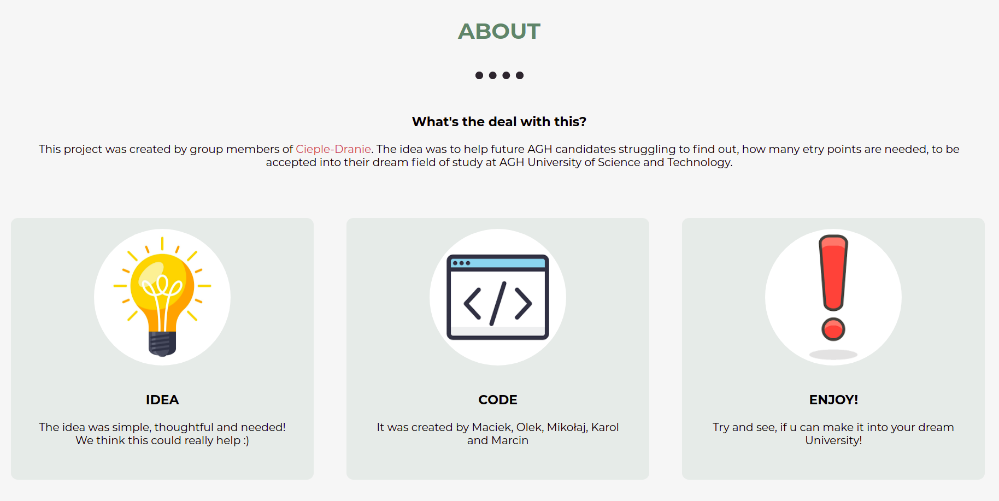

# Welcome to my Website!

## Info about me
- I am at first year of It at AGH in Cracow 
- I love volleyball and football
- I hate C programming language and math analysis

## My Projects

### AGH recruitment points Calculator
 - the aim of the project is to help students calculate their recruitment points
 - Project is incomplete. We have done Python program and graphic website.
 - It allowed me to understand Github and practice it
 > - [**Maciej Bobrek**](https://github.com/maciejbobrek) 
 > - [**Aleksander Mystkowski**](https://github.com/Mythsty)
 > - [**Marcin Zub**](https://github.com/MarcinZ20) 
 > - [**Mikołaj Rożek**](https://github.com/mikrozek) 
 > - [**Karol Wójciak**](https://github.com/nextae) 
 - [Repository Link](https://github.com/AGH-Narzedzia-Informatyczne-2021-2022/Cieple-Dranie) and Website screenshots:
  

