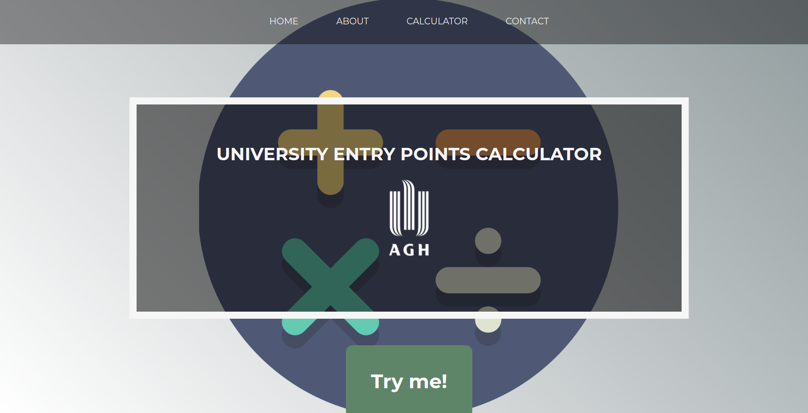
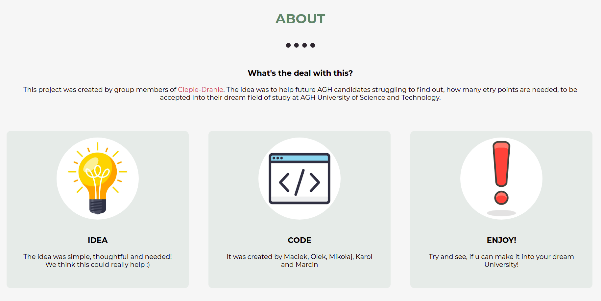
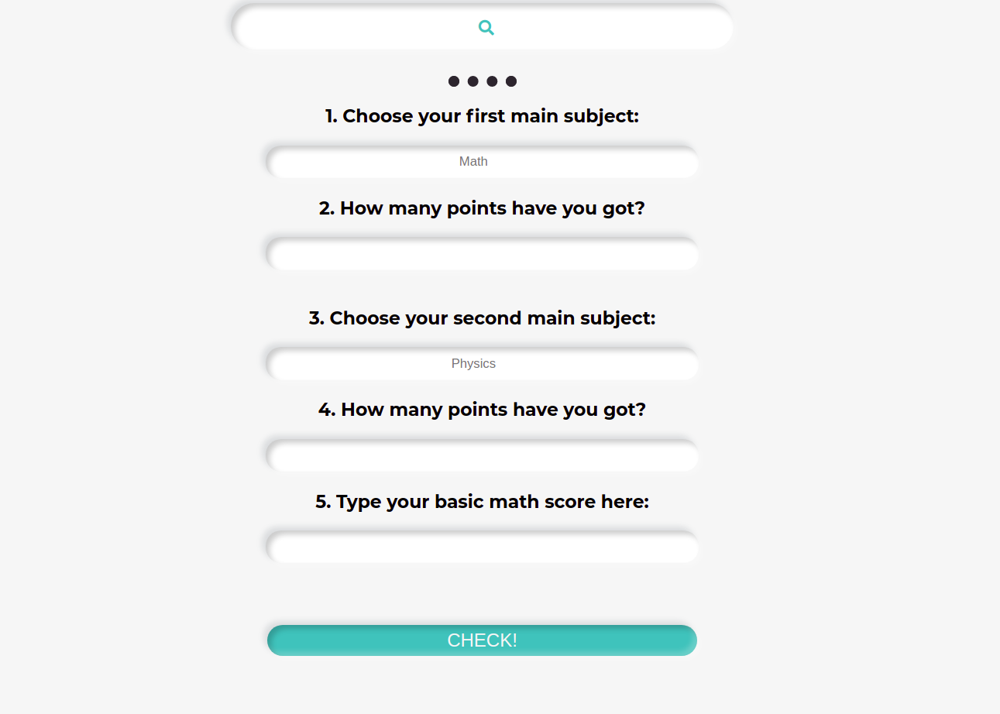

# Witaj na mojej stronie internetowej!

## Coś o mnie
- jestem studentem 1 roku studiów na AGH w Krakowie
- bardzo lubię siatkówkę
- nie lubie analizy matematycznej i języka C

## Projekty nad którymi pracuje

### Kalkulator Punktów AGH 
 - celem projektu jest pomoc osobom młodszym z rekrutacją
 - projekt nie został w 100% dokończony, została zrobiona strona internetowa i napisany program w Pythonie do liczenia punktów
 Wygląd naszej strony:
  

